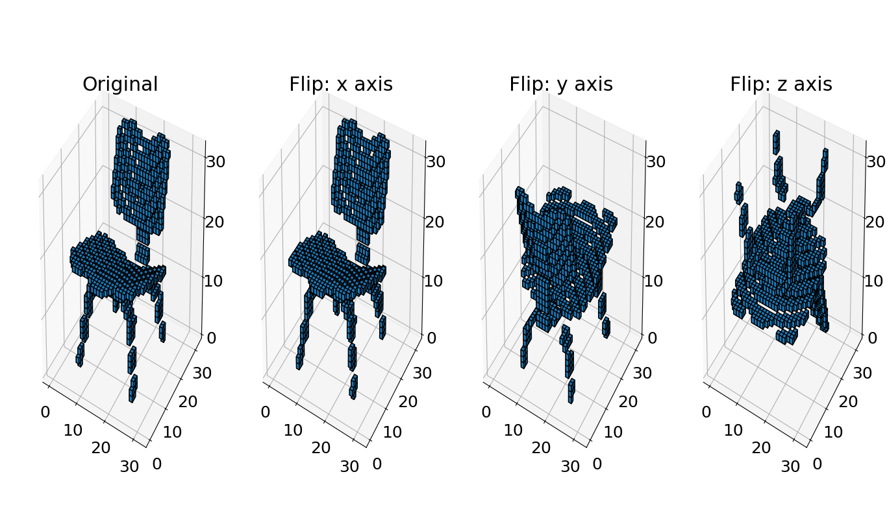
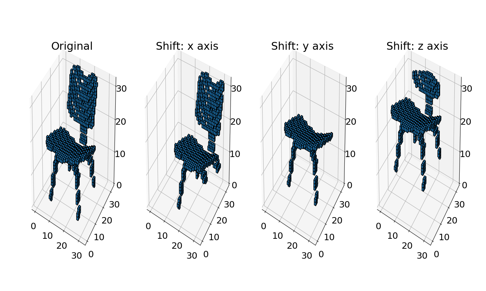
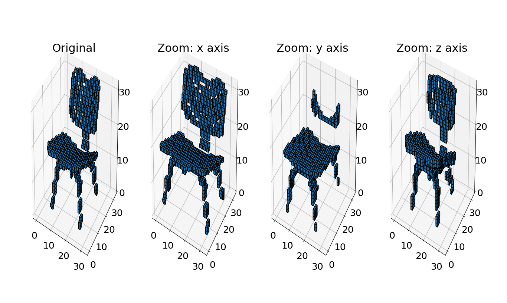
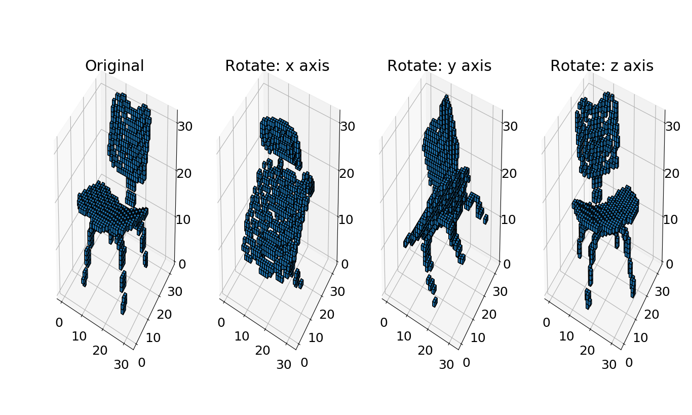

# Voxel Data Generator

This repository includes voxel data generator for data augmentation. The style of the generator is like Keras's ImageDataGenerator class.
Input data cab be augmented:
* Flip
* Shift
* Zoom
* Rotate

## Dependencies
scipy, numpy


## How to use

#### Load array data
prepare your data in array form.
```
data = np.load(path_to_data)
```

#### Import module
import the following module in this repository.
```
from voxel_data_generator import VoxelDataGenerator
```

#### Create instance
create an instance with arguments to specify which type you want to augment by.
```
# Some examples

# flip along y axis
c = VoxelDataGenerator(flip_axis=2)

# shift by 0.3 rate along x axis positive direction
c = VoxelDataGenerator(shift_axis=1, shift_range=0.3)

# zoom by 1.5 magnification along x axis
c = VoxelDataGenerator(zoom_axis=1, zoom_range=1.5)

# rotate by 45 degree around x axis
c = VoxelDataGenerator(rotate_axis=1, rotate_angle=45)
```

#### Build generator
build a generator by specifying data to be augmented and the number of data to generate.

```
# you can generate 3 data until StopIteration Exception is returned.
g = c.build(data=data, batch_size=32)

# you can also take labels as the second argument and pass the generator to Keras's fit_generator
g = c.build(data=data, label=label, batch_size=32)
model.fit_generator(g, steps_per_epoch=50, epochs=30)
# Note: as written in VoxelDataGenerator class, it is able to take only one type of augmentations for the current specification.
```

## Examples
You can get MODELNET10 in the following website.

PRINCETON MODELNET
(http://modelnet.cs.princeton.edu/)

#### Flip


#### Shift


#### Zoom


#### Rotate

